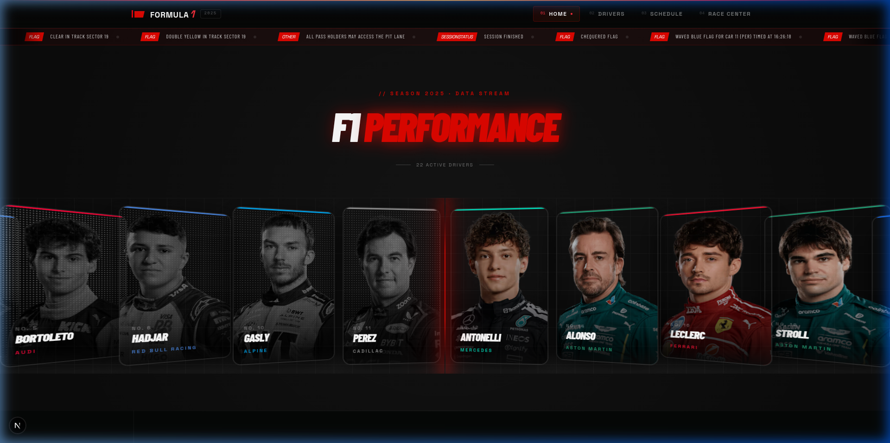
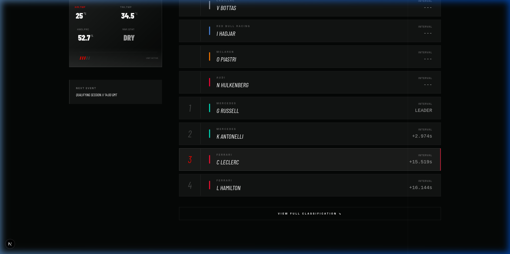
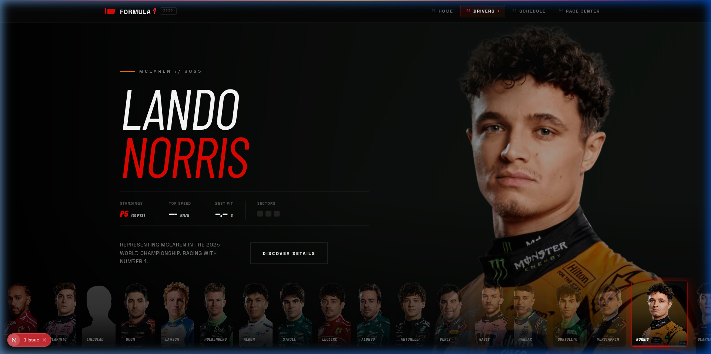
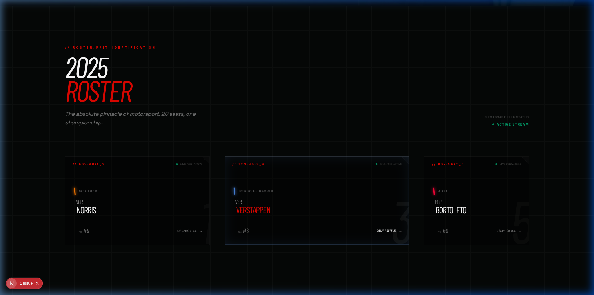
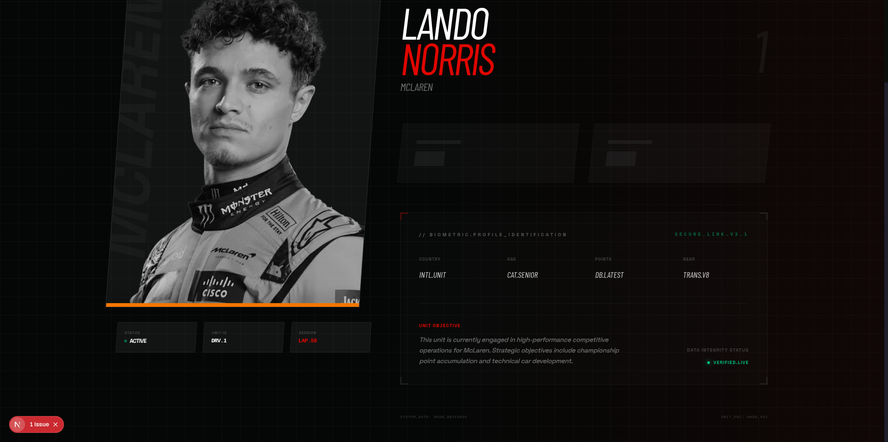
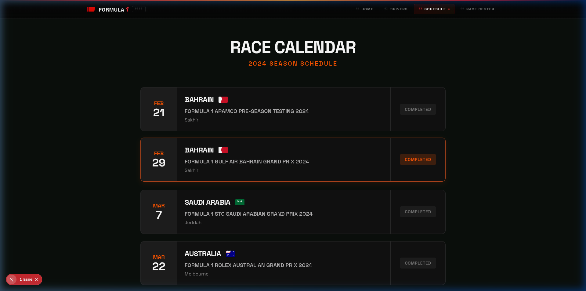
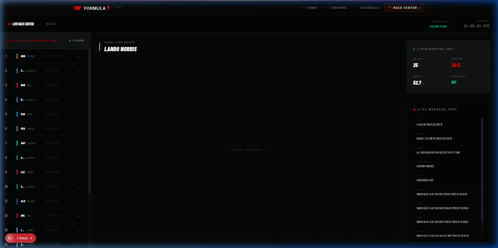

<div align="center">

<!-- Banner -->


<br/>

```
// SYSTEM.INIT >> FORMULA1_CENTRAL.v2.0 << BROADCAST.LIVE
```

<h1>
  
</h1>

**Platform data real-time Formula 1 berdesain premium — powered by OpenF1 API.**

[](https://nextjs.org)
[](https://www.typescriptlang.org)
[](https://tailwindcss.com)
[](https://www.framer.com/motion)
[](https://openf1.org)

</div>

---

## `// BROADCAST.FEED`

**Formula 1 Central** adalah platform web premium yang menghadirkan data Formula 1 secara real-time dengan tampilan bertema high-tech F1 Command Center. Dibangun menggunakan Next.js 15, TypeScript, dan Tailwind CSS, platform ini mengintegrasikan OpenF1 API untuk menampilkan data sesi, klasemen, telemetri, dan profil driver langsung dari sumber resmi FIA.

---

## `// SYSTEM.SCREENSHOTS`

### 🏠 Home — Performance Dashboard

> Hero section dengan live race control ticker dan 3D driver cards


<br/>

### 🏆 Championship Standings — Command Center

> Klasemen driver dan konstruktor real-time dengan layout asimetris bertema militer



<br/>

### 🏎️ Drivers — Hero Slider

> Slider driver interaktif dengan foto HD, data performa, dan transisi sinematik



<br/>

### 📋 Drivers — 2025 Roster Grid

> Grid roster asimetris bertema teknikal dengan team color glow dan watermark besar



<br/>

### 🗂️ Driver Profile — Executive Dossier

> Halaman profil driver bertema classified dossier dengan foto HD, telemetri live, dan animasi masuk sinematik



<br/>

### 📅 Race Calendar — 2024 Season

> Kalender balap 2024 dengan animasi cascade stagger reveal dan status race (Completed / Upcoming)



<br/>

### 📡 Race Center — Mission Control

> Dashboard telemetri live dengan Live Classification, TelemetryGauges SVG, Race Control feed, dan Weather Monitor



---

## `// FEATURE.MODULE_LIST`

| Modul                 | Deskripsi                                                                          |
| --------------------- | ---------------------------------------------------------------------------------- |
| 🏠 **Home Dashboard** | Hero dengan HeroCarousel, live Race Control ticker, Championship Standings         |
| 🏎️ **Drivers Page**   | Hero slider bertimer otomatis, 2025 roster grid asimetris                          |
| 🗂️ **Driver Profile** | Technical Dossier dengan foto HD, telemetri stream, animasi sinematik              |
| 📅 **Race Schedule**  | Kalender 2024 dengan status race live                                              |
| 📡 **Race Center**    | Mission Control dashboard dengan Live Leaderboard, TelemetryGauges, Weather        |
| ⚡ **Performance**    | React Suspense streaming, Next.js caching `revalidate`, skeleton loaders           |
| 🎞️ **Animations**     | Framer Motion scroll-triggered reveal, stagger, slide-in, fade-up di semua section |

---

## `// STACK.TECHNICAL_SPECS`

```
CORE TECHNOLOGIES:
├── Framework     → Next.js 15 (App Router + Turbopack)
├── Language      → TypeScript 5
├── Styling       → Tailwind CSS 4 + Custom Design System
├── Animations    → Framer Motion
├── Fonts         → Barlow Condensed (F1 Display), Space Grotesk (Mono)
├── Images        → Next.js Image (Optimized, media.formula1.com CDN)
└── Data Source   → OpenF1 API v1 (Real-time F1 data)

PERFORMANCE:
├── Caching       → next: { revalidate: 3600 } on standings
├── Streaming     → React Suspense + Skeleton Loaders
├── Images        → 7col HD transforms from F1 media CDN
└── Build         → Turbopack (dev), optimized production bundle
```

---

## `// SETUP.INSTALLATION`

### Prerequisites

- Node.js 18+
- npm / yarn / pnpm

### Quick Start

```bash
# Clone repository
git clone https://github.com/ArkanFzi/Formula1.git
cd Formula1/frontend

# Install dependencies
npm install

# Run development server
npm run dev
```

Buka [http://localhost:3000](http://localhost:3000) di browser.

### Build untuk Production

```bash
npm run build
npm start
```

---

## `// ARCHITECTURE.OVERVIEW`

```
frontend/
├── app/
│   ├── page.tsx                    # Home — Championship Dashboard
│   ├── drivers/
│   │   ├── page.tsx                # Drivers Roster
│   │   └── [driverNumber]/
│   │       ├── page.tsx            # Driver Profile (Server)
│   │       └── DriverProfileClient.tsx  # Animated Client Shell
│   ├── schedule/
│   │   ├── page.tsx                # Race Calendar (Server)
│   │   └── ScheduleClient.tsx      # Animated Client Shell
│   ├── race-center/
│   │   └── page.tsx                # Mission Control Dashboard
│   ├── components/
│   │   ├── AnimatedSection.tsx     # Shared scroll-trigger wrapper
│   │   ├── DriverStandings.tsx     # Championship Driver Cards
│   │   ├── TeamStandings.tsx       # Constructor Cards
│   │   ├── SessionResults.tsx      # Latest Session Telemetry
│   │   ├── Navbar.tsx              # Asymmetric Navigation
│   │   ├── Page/
│   │   │   ├── HeroSection.tsx     # Hero + Carousel
│   │   │   ├── DriverHeroSlider.tsx # Timed Driver Slider
│   │   │   ├── DriverCard.tsx      # Roster Card
│   │   │   └── RaceControlTicker.tsx # Live Flag Feed
│   │   └── RaceCenter/
│   │       ├── LiveLeaderboard.tsx  # Real-time Classification
│   │       ├── TelemetryGauges.tsx  # SVG Speed/RPM Gauges
│   │       └── WeatherConditionCard.tsx # Atmospheric Monitor
│   ├── lib/
│   │   └── f1.ts                   # OpenF1 API functions + getHDImage
│   └── types/
│       └── f1.ts                   # TypeScript interfaces
└── lib/
    └── api.ts                      # Ergast/Schedule API functions
```

---

## `// DATA.API_SOURCE`

Platform ini menggunakan **[OpenF1 API](https://openf1.org)** — API resmi berbasis komunitas yang menyediakan data Formula 1 real-time:

| Endpoint        | Data                                   |
| --------------- | -------------------------------------- |
| `/drivers`      | Profil driver, headshot, team info     |
| `/car_data`     | Kecepatan, gear, RPM live              |
| `/laps`         | Waktu lap, sektor, data historikal     |
| `/weather`      | Suhu udara/aspal, kelembaban, hujan    |
| `/race_control` | Flag, SC deployment, pesan ofisial     |
| `/sessions`     | Info sesi (Race, Qualifying, Practice) |

---

## `// LICENSE.UNIT`

```
OPEN SOURCE // MIT LICENSE
AUTHORIZED FOR: Personal & Educational Use
DATA SOURCE: OpenF1 API (Community)
DISCLAIMER: Not affiliated with Formula 1 or FIA
```

---

<div align="center">

```
// END_SYSTEM.BROADCAST >> FORMULA1_CENTRAL << SIGNAL.CLEAR
```

**Built with 🏎️ by [ArkanFzi](https://github.com/ArkanFzi)**

_"Speed is everything. Data is power."_

</div>
